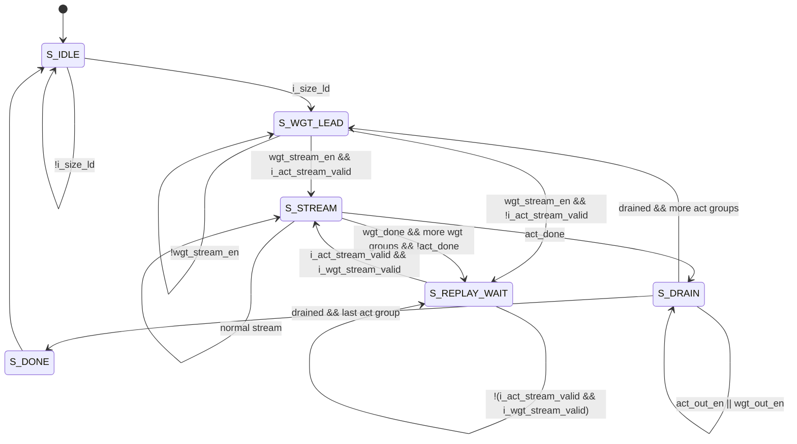

# Sequencer State Diagram

## State Notes

| State | Meaning |
| --- | --- |
| `S_IDLE` | Wait for `i_size_ld`; latch matrix sizes and base addresses. |
| `S_WGT_LEAD` | Let weight stream enter one beat earlier for systolic-array skew. |
| `S_STREAM` | Normal act/wgt synchronized stream; pipeline advances only on valid handshakes. |
| `S_REPLAY_WAIT` | Hold the pipeline while waiting for both act and replayed wgt stream to be valid. |
| `S_DRAIN` | Stop new SRAM streams and flush remaining skewed act/wgt data through the array. |
| `S_DONE` | Transaction complete. |
